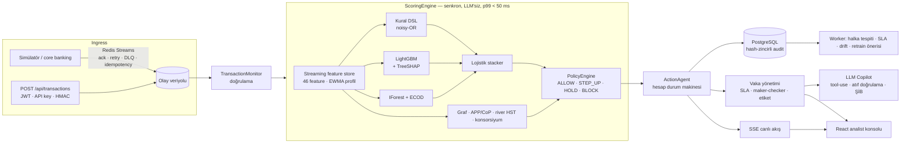

# Anil3 — Gerçek zamanlı Fraud & AML Platformu

> **Kural + LightGBM + anomali + varlık grafı + APP motoru** ile hibrit skorlayan, **ALLOW / STEP_UP / HOLD / BLOCK** kademeli aksiyon uygulayan, analist vaka yönetimi ve **MASAK ŞİB taslağı yazan LLM copilot** sunan, tek komutla ayağa kalkan bankacılık fraud platformu (Feedzai / Featurespace ARIC / Stripe Radar mimarisinden esinlenilmiştir).

**English summary:** Anil3 is a real-time banking fraud & AML platform: a streaming feature store, a hybrid scorer (safe rule DSL + LightGBM with TreeSHAP reason codes + IsolationForest/ECOD + entity-graph mule detection + APP-scam/Confirmation-of-Payee engine + online river model) behind a policy layer with graduated actions, analyst case management with SLA and maker-checker, an LLM investigator copilot (tool use, citation-validated outputs, MASAK SAR drafts) that *advises but never decides*, champion/challenger shadow scoring and PSI drift monitoring. Synchronous scoring p99 is in the low milliseconds; everything runs offline in demo mode.

  

## 30 saniyede çalıştır

```bash
cp .env.example .env        # opsiyonel — LLM anahtarı yoksa DEMO modu
docker compose up --build   # postgres, redis, migrate, api, worker, simulator
# → http://localhost:8000   (port doluysa: API_PORT=8010 docker compose up)
```

Demo kullanıcıları: `analist / analist123`, `kidemli_analist / kidemli123`, `admin / admin123`.
Gözlemlenebilirlik: `docker compose --profile observability up` → Prometheus `:9090`, Grafana `:3000` (hazır pano).

**LLM modu:** `.env`'de `LLM_API_KEY` varsa başlangıç logu `LLM: CANLI (<model> @ <LLM_BASE_URL sunucusu>)` der ve copilot canlı modeli kullanır; yoksa deterministik **DEMO** moduna düşer — tüm akışlar (özet, karar önerisi, ŞİB, sohbet) yine çalışır. Canlı çağrı hata verirse o çağrı `llm_mode="fallback"` ile demo çıktısına düşer. Anahtar hiçbir log/yanıtta görünmez; LLM'e giden veride TCKN/IBAN/telefon/e-posta/isim pseudonimleştirilir (KVKK).

## Mimari



Ayrıntı: [`docs/ARCHITECTURE.md`](docs/ARCHITECTURE.md) · kararlar: [`docs/adr/`](docs/adr) · model: [`docs/MODEL_CARD.md`](docs/MODEL_CARD.md) · uyum: [`docs/COMPLIANCE.md`](docs/COMPLIANCE.md) · performans: [`docs/PERFORMANCE.md`](docs/PERFORMANCE.md) · demo: [`docs/DEMO_SCRIPT.md`](docs/DEMO_SCRIPT.md).

## Özellikler ve sektör kıyası

| Yetkinlik | Feedzai / ARIC / Radar | Anil3 |
|---|---|---|
| Gecikme | < 50 ms p99 | Senkron skor p99 ≈ 2–11 ms (ölçüm: `scripts/load_test.py`) |
| Skor motoru | Kural + GBM + anomali + graf | Güvenli YAML/DB kural DSL + LightGBM + IForest/ECOD + graf + APP + online model → kalibre stacker |
| Davranış profili | Adaptif (ABA) | EWMA profil (yalnız güvenilir olaylarla öğrenir) + river Half-Space Trees |
| Feature store | Kayan pencere | 1dk/1s/24s/7g adet+tutar, yeni alıcı, cihaz yaşı, fan-in, yazma ritmi… (Redis / bellek, online=offline) |
| Mule ağı | Entity graph | networkx grafı: fan-in→fan-out, 24 saatlik katmanlama döngüsü, fraud yakınlığı, Louvain halkaları, PageRank |
| APP scam | Ayrı model, CoP | APP skoru + Confirmation of Payee + dinamik uyarı + cooling-off HOLD + "Bu kişiyi tanıyor musunuz?" |
| Aksiyon | Kademeli friction | ALLOW / STEP_UP / HOLD / BLOCK + tipoloji tavanı (mağdur koruması, tipping-off) |
| Vaka yönetimi | Kuyruk, SLA, not | Alert→vaka gruplama (müşteri/halka), iç SLA 4 saat, MASAK 10 iş günü, kanıt ekleri, maker-checker |
| Açıklanabilirlik | Reason code / SHAP | Türkçe reason code (kural/ML/sinyal/politika), TreeSHAP şelalesi |
| GenAI copilot | Farol / InvestigateAI | 7 araçlı tool-use döngüsü, atıf doğrulamalı özet, karar önerisi, ŞİB taslağı (PDF/JSON), SSE sohbet |
| Model yönetişimi | Champion/challenger | Gölge skorlama, çevrimiçi/çevrimdışı karşılaştırma, PSI drift, maker-checker terfi, aktif öğrenme kuyruğu |
| Konsorsiyum | Feedzai IQ | Tuzlu SHA-256 paylaşımlı kara liste + FedAvg demosu |
| Uyum | MASAK, KVKK | ŞİB taslağı + SLA sayacı, KVKK maskeleme, hash-zincirli audit (`GET /api/audit/verify`) |

## Senaryo tetikleme (Demo modu)

Konsolda **Senaryo** sekmesi (veya `POST /api/scenarios/{ad}`): `ato` → **BLOCK**, `app` → **HOLD + dinamik uyarı**, `mule_ring` → **HOLD + vaka + graf halkası**, `smurfing` → **HOLD + AML vakası + otomatik ŞİB taslağı**, `card_testing` → **BLOCK**. Simülatör ayrıca her 3 dakikada rastgele bir saldırı enjekte eder (`SIM_SCENARIO_EVERY`).

## Geliştirme

```bash
pip install -e ".[dev]"
ruff check . && ruff format --check . && mypy app && python -m pytest -q --cov=app
python scripts/generate_synthetic.py && python scripts/train_models.py   # veri + model (≈40 sn)
python scripts/load_test.py --mode engine --count 5000                    # p50/p95/p99
cd frontend && npm ci && npm run build                                    # SPA (FastAPI '/' altında sunar)
```

Kalite kapıları: ruff, mypy, pytest (388 test, kapsam %94), docker compose build — CI: `.github/workflows/ci.yml`.

## Lisans

MIT — bkz. [LICENSE](LICENSE). Tüm müşteri, IBAN ve yaptırım verileri kurgusaldır.
