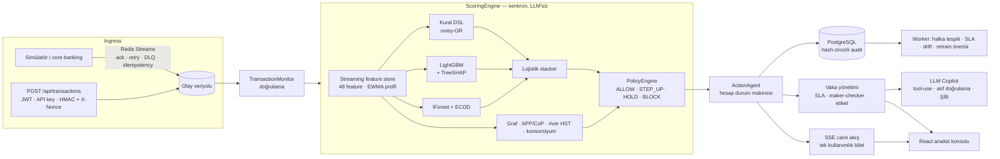
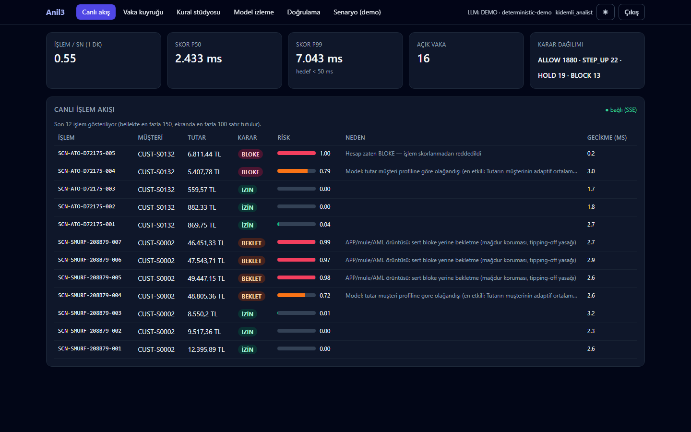
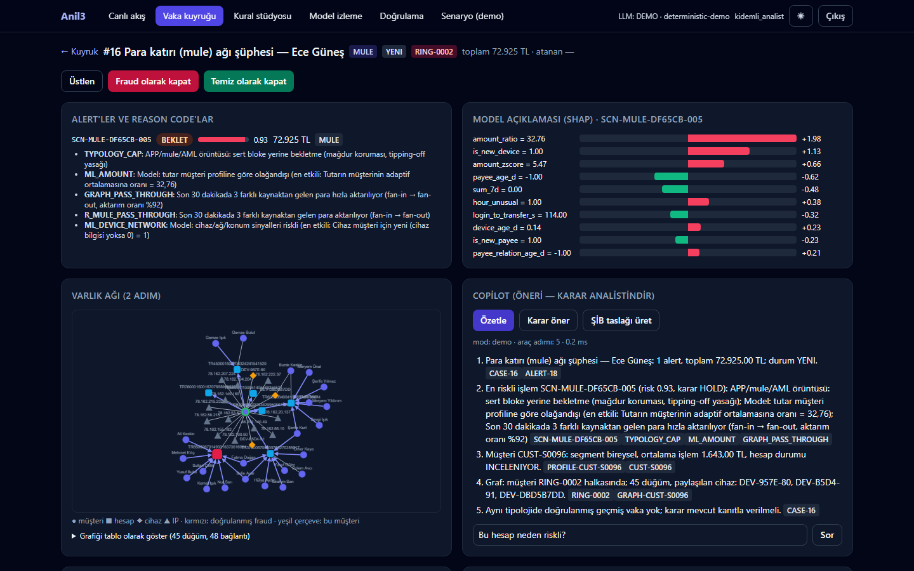
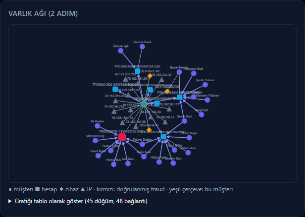
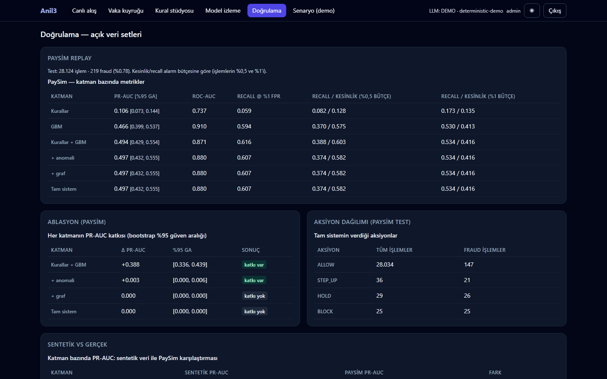
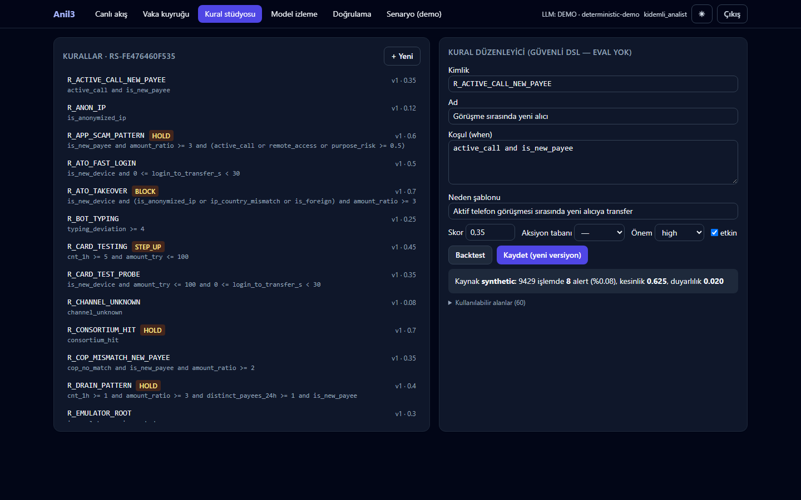

# Anil3 — Gerçek zamanlı Fraud & AML Platformu

[](https://github.com/tunadeniz1304/Anil3/actions/workflows/ci.yml)

> **Kural + LightGBM + anomali + varlık grafı + APP motoru** ile hibrit skorlayan, **ALLOW / STEP_UP / HOLD / BLOCK** kademeli aksiyon uygulayan, analist vaka yönetimi ve **MASAK ŞİB taslağı yazan LLM copilot** sunan, tek komutla ayağa kalkan bir bankacılık fraud platformu prototipi. Gerçek banka verisiyle doğrulanmamıştır; bkz. [Sınırlamalar](#sınırlamalar).

**English summary:** Anil3 is a real-time banking fraud & AML prototype: a streaming feature store, a hybrid scorer (safe rule DSL + LightGBM with TreeSHAP reason codes + IsolationForest/ECOD + entity-graph mule detection + APP-scam/Confirmation-of-Payee engine + online river model) behind a policy layer with graduated actions, analyst case management with SLA and maker-checker, an LLM investigator copilot (tool use, citation-validated outputs, MASAK SAR drafts) that *advises but never decides*, champion/challenger shadow scoring and PSI drift monitoring. Latency targets refer to the in-process scoring engine only; HTTP single-client and concurrent measurements are reported separately in `docs/PERFORMANCE.md`. Validation uses public data (PaySim, Elliptic, ULB), not real bank data. Everything runs offline in demo mode.

## 30 saniyede çalıştır

```bash
cp .env.example .env        # LLM anahtarı yoksa DEMO modu
# .env içinde JWT_SECRET, AUDIT_HMAC_KEY ve CONSORTIUM_SALT'ı doldurun; her biri için:
python -c "import secrets; print(secrets.token_urlsafe(48))"
# yerel demo (dev modu + demo kullanıcıları):
ENVIRONMENT=dev SEED_DEMO_USERS=true docker compose up --build   # postgres, redis, migrate, api, worker, simulator
# → http://localhost:8000   (port doluysa: API_PORT=8010 docker compose up)
```

`docker compose` ve Docker imajı varsayılan olarak **`ENVIRONMENT=prod`** ile çalışır: `JWT_SECRET`, `AUDIT_HMAC_KEY` veya `CONSORTIUM_SALT` tanımlı değilse compose hiç başlamaz, başlangıç politikası da demo/zayıf sırları reddeder. Yerel demo için dev moduna `ENVIRONMENT=dev` ile **açıkça** geçilir. Demo kullanıcıları (`analist / analist123`, `kidemli_analist / kidemli123`, `admin / admin123`) yalnızca geliştirme ortamında eklenir: `SEED_DEMO_USERS` tanımlı değilse `ENVIRONMENT=prod` dışında açık, prod'da her zaman reddedilir; `docker compose` onları yalnızca `SEED_DEMO_USERS=true` ile ekler. Prod'daki kişisel hesaplar (maker-checker için en az iki farklı kıdemli analist/yönetici) `python scripts/create_user.py users.json <kullanıcı> <rol>` ile parola özetli bir dosyaya yazılır ve `USERS_FILE` ile yüklenir; parola komut satırından alınmaz.

Gözlemlenebilirlik: `/metrics` uç noktası `Authorization: Bearer <METRICS_TOKEN>` ister (`METRICS_TOKEN` boşsa 404 döner). Observability profilini açmadan önce aynı değeri `ops/prometheus/metrics_token` dosyasına yazın (dosya git'e girmez). Grafana anonim erişime kapalıdır: yönetici parolasını `ops/grafana/admin_password` dosyasına yazın (dosya git'e girmez). Sonra `docker compose --profile observability up` → Prometheus `:9090`, Grafana `:3000` (hazır pano, kullanıcı `admin`).

**LLM modu:** `.env`'de `LLM_API_KEY` varsa başlangıç logu `LLM: CANLI (<model> @ <LLM_BASE_URL sunucusu>)` der ve copilot canlı modeli kullanır. Yoksa deterministik **DEMO** moduna düşer: özet, karar önerisi, ŞİB ve sohbet şablonlardan üretilir. Canlı çağrı hata verirse o çağrı `llm_mode="fallback"` ile demo çıktısına düşer. Anahtar hiçbir log/yanıtta görünmez. LLM'e giden veride TCKN/IBAN/telefon/e-posta/isim pseudonimleştirilir (KVKK).

## Mimari



Ayrıntı: [`docs/ARCHITECTURE.md`](docs/ARCHITECTURE.md) · kararlar: [`docs/adr/`](docs/adr) · model: [`docs/MODEL_CARD.md`](docs/MODEL_CARD.md) · uyum: [`docs/COMPLIANCE.md`](docs/COMPLIANCE.md) · performans: [`docs/PERFORMANCE.md`](docs/PERFORMANCE.md) · doğrulama: [`docs/VALIDATION_REPORT.md`](docs/VALIDATION_REPORT.md) · veri: [`docs/DATA.md`](docs/DATA.md) · demo: [`docs/DEMO_SCRIPT.md`](docs/DEMO_SCRIPT.md).

## Özellikler

| Yetkinlik | Anil3'teki uygulama |
|---|---|
| Skor motoru | Güvenli YAML/DB kural DSL + LightGBM + IForest/ECOD + graf + APP + online model → lojistik stacker (yalnız stacker çıktısı kalibre; eşikler elle seçildi) |
| Davranış profili | EWMA profil + river Half-Space Trees. Öğrenme kuralı tek yerde (`app/features/learning.py::should_learn`), backfill ve canlı sistem aynı kuralı kullanır |
| Feature store | 1dk/1s/24s/7g adet+tutar, yeni alıcı, cihaz yaşı, fan-in, yazma ritmi… (Redis / bellek, online = offline). Müşteri başına kilit, Redis'te idempotent Lua commit |
| Mule ağı | networkx grafı: fan-in→fan-out, 24 saatlik katmanlama döngüsü, fraud yakınlığı, Louvain halkaları, PageRank |
| APP scam | APP skoru + Confirmation of Payee + dinamik uyarı + cooling-off HOLD + "Bu kişiyi tanıyor musunuz?" |
| Aksiyon | ALLOW / STEP_UP / HOLD / BLOCK + tipoloji tavanı (mağdur koruması, tipping-off). Step-up sonucu `POST /api/transactions/{id}/step-up-result` ile profile geri beslenir |
| Vaka yönetimi | Alert→vaka gruplama (müşteri/halka), iç SLA 4 saat, MASAK 10 iş günü (`holidays.Turkey`), kanıt ekleri, maker-checker, sunucu taraflı sayfalı ve filtreli kuyruk |
| Açıklanabilirlik | Türkçe reason code (kural/ML/sinyal/politika), TreeSHAP şelalesi |
| Copilot | 7 araçlı tool-use döngüsü, atıf doğrulamalı özet, karar önerisi, ŞİB taslağı (PDF/JSON), SSE sohbet |
| Model yönetişimi | Champion `fraud_gbm_v5` / challenger `fraud_gbm_v6` gölge skorlama, çevrimiçi/çevrimdışı karşılaştırma, PSI drift, maker-checker terfi, aktif öğrenme kuyruğu |
| Uyum desteği | ŞİB taslağı + SLA sayacı, KVKK maskeleme, hash-zincirli audit (`GET /api/audit/verify`). Kapsam ve sınırlar: [`docs/COMPLIANCE.md`](docs/COMPLIANCE.md) |

**Gecikme.** "p99 < 50 ms" hedefi yalnızca **motor (skor motoru, süreç içi)** içindir: `scripts/load_test.py --mode engine` ile ölçülür, HTTP ve ağ katmanı dahil değildir. HTTP üzerinden tek istemcili ve eşzamanlı ölçümler [`docs/PERFORMANCE.md`](docs/PERFORMANCE.md) içinde ayrı tablolarda verilir. Bütün ölçümler tek düğümde yapıldı.

## İlham alınan desenler

Aşağıdaki desenler kamuya açık ürün anlatımlarından esinlenmiştir. Anil3 bu ürünlerin eşdeğeri değildir ve onlarla karşılaştırmalı bir ölçüm yapılmadı.

- **Feedzai Farol'dan esinlenen copilot deseni:** analiste vaka özeti, karar önerisi ve rapor taslağı sunan, kararı kendisi vermeyen bir yardımcı. Anil3'te çıktılar atıf doğrulamasından geçer.
- **Featurespace ARIC tarzı uyarlanabilir davranış profilleri:** müşteri başına EWMA profil ve online anomali modeli. Profil yalnızca güvenilir olaylarla (ALLOW, başarılı step-up, analistin "temiz" etiketi) öğrenir.
- **Stripe Radar tarzı kural + ML hibriti:** okunabilir kural DSL'i ile gradient boosting skorunun birlikte kullanılması ve kural isabetlerinin reason code olarak gösterilmesi.

## Sınırlamalar

- **Gerçek banka verisi yok.** Modeller seed'li sentetik veriyle eğitildi. Doğrulama halka açık verilerle yapıldı ([`docs/VALIDATION_REPORT.md`](docs/VALIDATION_REPORT.md), [`docs/DATA.md`](docs/DATA.md)):
  - **PaySim** (sentetik, ancak gerçek mobil para kayıtlarına göre kalibre edilmiş bir simülasyon), %10 alıcı örneği, test dönemi: tek başına GBM PR-AUC **0.3732**, tam hat (`full`) PR-AUC **0.3919** [0.3463, 0.4417]. %1 alarm bütçesinde recall 0.5471 [0.5026, 0.5975], precision 0.2186. Test dönemindeki 382 fraud işleminin 280'i ALLOW aldı (eşikler PaySim'e göre ayarlanmadı).
  - **Sentetik veri:** eski üretici etiketi cihaz kimliğine sızdırıyordu; eski 0.971 PR-AUC bu sızıntıdan geliyordu. Parmak izleri temizlendikten ve asimetrik etiket gürültüsü eklendikten sonra tek başına GBM PR-AUC **0.8423**, tam hat **0.8295**. Bu iki sayı doğrulama artefaktının kendi 70/15/15 bölmesinden; champion `fraud_gbm_v5`'in hibrit test PR-AUC'si 0.8355 (Brier 0.00662, ECE 0.00378) ise kayıt defterindeki eğitim bölmesinden gelir, bu yüzden doğrudan karşılaştırılamaz. Sentetik sonuçlar üreticinin öğrenilebilirliğini gösterir, gerçek performansı değil.
  - **Elliptic** (graf modülü): LightGBM `all` illicit F1 **0.7984** [0.7798, 0.817]. Yalnız yapısal graf özellikleriyle F1 **0.1177**, `all+graph` 0.7891; graf özellikleri katkı sağlamadı.
  - **ULB** kredi kartı: GBM PR-AUC 0.7335 [0.6092, 0.8451], anomali eklenen hibrit 0.7091; fark anlamlı değil.
- **Davranışsal biyometri simüle ediliyor.** Yazma ritmi, yapıştırma, oturum süresi gibi sinyaller simülatörden gelir, gerçek bir istemci SDK'sından gelmez.
- **Konsorsiyum bir demodur:** tuzlu SHA-256 hash ile paylaşılan kara liste ve numpy FedAvg. Gerçek kurumlar arası paylaşım yok.
- **GNN yok.** Graf modülü kural ve istatistik tabanlıdır (networkx). GraphSAGE denemesi yapılmadı.
- **Tek düğüm performansı.** Ölçümler tek makinede, tek API süreciyle yapıldı. Yatay ölçekleme denenmedi.
- **Kurallar ve APP ağırlıkları elle ayarlandı**, veriyle kalibre edilmedi.
- **FATF gri listesi doğrulanamadı.** Kara liste (IR, KP, MM) MAS yeniden yayımıyla doğrulandı. Gri liste ikincil kaynaklardan derlendi ve dosyada "doğrulanmadı" olarak işaretli (`data/jurisdictions/fatf_2026-06.json`).
- **LLM copilot demo modda deterministik şablondur.** Anahtar yoksa özet, öneri ve ŞİB taslağı şablonlardan üretilir. Bu çıktılar bir dil modelinin değerlendirmesi değildir.

## Ekran görüntüleri

| Canlı akış | Vaka detayı |
|---|---|
|  |  |
| **Varlık grafı** | **Doğrulama** |
|  |  |
| **Kural stüdyosu** | |
|  | |

## Güvenlik notları

- Demo kullanıcıları yalnızca `SEED_DEMO_USERS` açıkken eklenir (varsayılan: prod dışında açık).
- `ENVIRONMENT=prod` (compose ve imajın varsayılanı) boş/kısa/örnek `JWT_SECRET`, demo kullanıcıları, demo `CONSORTIUM_SALT`, eksik/zayıf `AUDIT_HMAC_KEY`, 32 karakterden kısa ya da örnek `ADMIN_TOKEN` / `SERVICE_API_KEY` / `SERVICE_HMAC_SECRET` ve `memory://` hız sınırı deposu ile başlamayı reddeder; `WEB_CONCURRENCY>1` her ortamda `JWT_SECRET` ve `REDIS_URL` ister. Politika hem API'de hem worker'da uygulanır (`app/security/startup.py`).
- SSE canlı akışı sorgu dizesinde JWT kabul etmez. İstemci `POST /api/stream/ticket` ile kısa ömürlü, **tek kullanımlık** bir bilet alır.
- Servis ingest'i HMAC imzalıdır. Her istek bir `X-Nonce` taşır ve aynı nonce ikinci kez kabul edilmez (replay koruması).
- `/metrics` `METRICS_TOKEN` ister (bkz. yukarı).

## Senaryo tetikleme (Demo modu)

Konsolda **Senaryo** sekmesi (veya `POST /api/scenarios/{ad}`): `ato` → **BLOCK**, `app` → **HOLD + dinamik uyarı**, `mule_ring` → **HOLD + vaka + graf halkası**, `smurfing` → **HOLD + AML vakası + otomatik ŞİB taslağı**, `card_testing` → en az **STEP_UP** (kural tabanı; model riski eşiği geçerse HOLD, `CARD_TESTING` vakası). Simülatör ayrıca her 3 dakikada rastgele bir saldırı enjekte eder (`SIM_SCENARIO_EVERY`).

## Geliştirme

```bash
pip install -e ".[dev]"
ruff check . && ruff format --check . && mypy app && python -m pytest -q --cov=app
python scripts/generate_synthetic.py && python scripts/train_models.py   # veri + model
python scripts/load_test.py --mode engine --count 5000                    # motor p50/p95/p99 (süreç içi)
cd frontend && npm ci && npm run build                                    # SPA (FastAPI '/' altında sunar)
```

Halka açık veriyle doğrulama (ağa çıkan tek betik indiricidir; veriler `data/external/` altına iner ve git'e girmez):

```bash
python scripts/fetch_public_fraud_data.py                                # PaySim + Elliptic + ULB, checksum'lı
python scripts/validate_public_data.py --dataset paysim --sample-frac 0.1
python scripts/validate_public_data.py --dataset elliptic
python scripts/validate_public_data.py --dataset ulb
python scripts/champion_selection.py                                     # champion/challenger seçimi (dört göz)
```

Kalite kapıları: ruff, mypy, pytest, frontend build, docker compose build. CI: `.github/workflows/ci.yml` (durum yukarıdaki rozette).

## Lisans

MIT — bkz. [LICENSE](LICENSE). Tüm müşteri, IBAN ve yaptırım verileri kurgusaldır. Halka açık veri setleri kendi lisanslarına tabidir ([`docs/DATA.md`](docs/DATA.md)).
