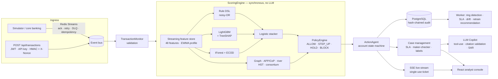

[Türkçe](README.tr.md) · **English**

# fraud-aml-platform — Real-time Fraud & AML Platform

[](https://github.com/tunadeniz1304/fraud-aml-platform/actions/workflows/ci.yml)

> A banking fraud platform prototype that starts with a single command: it scores transactions with a hybrid of **rules + LightGBM + anomaly detection + entity graph + APP engine**, applies graduated **ALLOW / STEP_UP / HOLD / BLOCK** actions, and provides analyst case management plus an **LLM copilot that drafts MASAK SARs (ŞİB)**. It has not been validated on real bank data; see [Limitations](#limitations).

## Run in 30 seconds

```bash
cp .env.example .env        # DEMO mode if there is no LLM key
# fill in JWT_SECRET, AUDIT_HMAC_KEY and CONSORTIUM_SALT in .env; for each one:
python -c "import secrets; print(secrets.token_urlsafe(48))"
# local demo (dev mode + demo users):
ENVIRONMENT=dev SEED_DEMO_USERS=true docker compose up --build   # postgres, redis, migrate, api, worker, simulator
# → http://localhost:8000   (if the port is taken: API_PORT=8010 docker compose up)
```

`docker compose` and the Docker image run with **`ENVIRONMENT=prod`** by default: if `JWT_SECRET`, `AUDIT_HMAC_KEY` or `CONSORTIUM_SALT` is not set, compose does not start at all, and the startup policy also rejects demo/weak secrets. For a local demo you switch to dev mode **explicitly** with `ENVIRONMENT=dev`. Demo users (`analist / analist123`, `kidemli_analist / kidemli123`, `admin / admin123`) are only added in development: if `SEED_DEMO_USERS` is unset it is on everywhere except `ENVIRONMENT=prod`, and in prod it is always rejected; `docker compose` adds them only with `SEED_DEMO_USERS=true`. Personal accounts in prod (for maker-checker, at least two different senior analysts/managers) are written to a file with hashed passwords via `python scripts/create_user.py users.json <username> <role>` and loaded with `USERS_FILE`; the password is not taken from the command line.

Observability: the `/metrics` endpoint requires `Authorization: Bearer <METRICS_TOKEN>` (it returns 404 if `METRICS_TOKEN` is empty). Before enabling the observability profile, write the same value to `ops/prometheus/metrics_token` (the file is not committed to git). Grafana anonymous access is disabled: write the admin password to `ops/grafana/admin_password` (the file is not committed to git). Then `docker compose --profile observability up` → Prometheus `:9090`, Grafana `:3000` (prebuilt dashboard, user `admin`).

**LLM mode:** if `LLM_API_KEY` is set in `.env`, the startup log says `LLM: CANLI (<model> @ <LLM_BASE_URL sunucusu>)` (i.e. live, `<model>` @ the `LLM_BASE_URL` host) and the copilot uses the live model. Otherwise it falls back to deterministic **DEMO** mode: the summary, decision recommendation, SAR (ŞİB) and chat are generated from templates. If a live call fails, that call falls back to the demo output with `llm_mode="fallback"`. The key never appears in any log or response. In data sent to the LLM, TCKN (Turkish national ID)/IBAN/phone/e-mail/name are pseudonymised (KVKK).

## Architecture



Details: [`docs/ARCHITECTURE.md`](docs/ARCHITECTURE.md) · decisions: [`docs/adr/`](docs/adr) · model: [`docs/MODEL_CARD.md`](docs/MODEL_CARD.md) · compliance: [`docs/COMPLIANCE.md`](docs/COMPLIANCE.md) · performance: [`docs/PERFORMANCE.md`](docs/PERFORMANCE.md) · validation: [`docs/VALIDATION_REPORT.md`](docs/VALIDATION_REPORT.md) · data: [`docs/DATA.md`](docs/DATA.md) · demo: [`docs/DEMO_SCRIPT.md`](docs/DEMO_SCRIPT.md).

## Features

| Capability | Implementation in fraud-aml-platform |
|---|---|
| Scoring engine | Safe YAML/DB rule DSL + LightGBM + IForest/ECOD + graph + APP + online model → logistic stacker (only the stacker output is calibrated; thresholds were chosen by hand) |
| Behavioural profile | EWMA profile + river Half-Space Trees. The learning rule lives in one place (`app/features/learning.py::should_learn`); backfill and the live system use the same rule |
| Feature store | 1m/1h/24h/7d count+amount, new payee, device age, fan-in, typing rhythm… (Redis / in-memory, online = offline). Per-customer lock, idempotent Lua commit in Redis |
| Mule network | networkx graph: fan-in→fan-out, 24-hour layering cycles, fraud proximity, Louvain rings, PageRank |
| APP scam | APP score + Confirmation of Payee + dynamic warning + cooling-off HOLD + "Do you know this person?" |
| Action | ALLOW / STEP_UP / HOLD / BLOCK + typology ceiling (victim protection, tipping-off). Step-up results are fed back into the profile via `POST /api/transactions/{id}/step-up-result` |
| Case management | Alert→case grouping (customer/ring), internal SLA 4 hours, MASAK 10 business days (`holidays.Turkey`), evidence attachments, maker-checker, server-side paginated and filtered queue |
| Explainability | Turkish reason codes (rule/ML/signal/policy), TreeSHAP waterfall |
| Copilot | 7-tool tool-use loop, citation-validated summary, decision recommendation, SAR (ŞİB) draft (PDF/JSON), SSE chat |
| Model governance | Champion `fraud_gbm_v5` / challenger `fraud_gbm_v6` shadow scoring, online/offline comparison, PSI drift, maker-checker promotion, active learning queue |
| Compliance support | SAR (ŞİB) draft + SLA timer, KVKK masking, hash-chained audit (`GET /api/audit/verify`). Scope and limits: [`docs/COMPLIANCE.md`](docs/COMPLIANCE.md) |

**Latency.** The "p99 < 50 ms" target applies only to the **engine (scoring engine, in-process)**: it is measured with `scripts/load_test.py --mode engine` and does not include the HTTP and network layers. Single-client and concurrent measurements over HTTP are given in separate tables in [`docs/PERFORMANCE.md`](docs/PERFORMANCE.md). All measurements were taken on a single node.

## Inspiring patterns

The patterns below are inspired by publicly available product descriptions. fraud-aml-platform is not equivalent to these products, and no comparative measurement against them was made.

- **Copilot pattern inspired by Feedzai Farol:** an assistant that gives the analyst a case summary, a decision recommendation and a report draft, without making the decision itself. In fraud-aml-platform, outputs go through citation validation.
- **Featurespace ARIC-style adaptive behavioural profiles:** a per-customer EWMA profile and an online anomaly model. The profile learns only from trusted events (ALLOW, successful step-up, the analyst's "clean" label).
- **Stripe Radar-style rules + ML hybrid:** a readable rule DSL used together with a gradient boosting score, with rule hits shown as reason codes.

## Limitations

- **No real bank data.** Models were trained on seeded synthetic data. Validation was done with public data ([`docs/VALIDATION_REPORT.md`](docs/VALIDATION_REPORT.md), [`docs/DATA.md`](docs/DATA.md)):
  - **PaySim** (synthetic, but a simulation calibrated against real mobile money records), 10% payee sample, test period: standalone GBM PR-AUC **0.3732**, full pipeline (`full`) PR-AUC **0.3919** [0.3463, 0.4417]. At a 1% alert budget, recall 0.5471 [0.5026, 0.5975], precision 0.2186. Of the 382 fraud transactions in the test period, 280 received ALLOW (thresholds were not tuned for PaySim).
  - **Synthetic data:** the old generator leaked the label into the device ID; the old 0.971 PR-AUC came from this leak. After the fingerprints were removed and asymmetric label noise was added, standalone GBM PR-AUC is **0.8423** and the full pipeline **0.8295**. These two numbers come from the validation artefact's own 70/15/15 split; the champion `fraud_gbm_v5`'s hybrid test PR-AUC of 0.8355 (Brier 0.00662, ECE 0.00378) comes from the training split in the registry, so they are not directly comparable. Synthetic results show the learnability of the generator, not real-world performance.
  - **Elliptic** (graph module): LightGBM `all` illicit F1 **0.7984** [0.7798, 0.817]. With structural graph features only, F1 **0.1177**; `all+graph` 0.7891; the graph features did not contribute.
  - **ULB** credit card: GBM PR-AUC 0.7335 [0.6092, 0.8451], hybrid with anomaly added 0.7091; the difference is not significant.
- **Behavioural biometrics are simulated.** Signals such as typing rhythm, pasting and session duration come from the simulator, not from a real client SDK.
- **The consortium is a demo:** a blacklist shared via salted SHA-256 hashes and numpy FedAvg. There is no real cross-institution sharing.
- **No GNN.** The graph module is rule- and statistics-based (networkx). A GraphSAGE experiment was not carried out.
- **Single-node performance.** Measurements were taken on a single machine with a single API process. Horizontal scaling was not tested.
- **Rules and APP weights were tuned by hand**, not calibrated on data.
- **The FATF grey list could not be verified.** The blacklist (IR, KP, MM) was verified against the MAS republication. The grey list was compiled from secondary sources and is marked "not verified" in the file (`data/jurisdictions/fatf_2026-06.json`).
- **In demo mode the LLM copilot is a deterministic template.** Without a key, the summary, recommendation and SAR (ŞİB) draft are generated from templates. These outputs are not a language model's assessment.

## Screenshots

| Live stream | Case detail |
|---|---|
|  |  |
| **Entity graph** | **Validation** |
|  |  |
| **Rule studio** | |
|  | |

## Security notes

- Demo users are added only when `SEED_DEMO_USERS` is on (default: on outside prod).
- `ENVIRONMENT=prod` (the default for compose and the image) refuses to start with an empty/short/example `JWT_SECRET`, demo users, the demo `CONSORTIUM_SALT`, a missing/weak `AUDIT_HMAC_KEY`, an `ADMIN_TOKEN` / `SERVICE_API_KEY` / `SERVICE_HMAC_SECRET` shorter than 32 characters or left at the example value, or a `memory://` rate-limit store; `WEB_CONCURRENCY>1` requires `JWT_SECRET` and `REDIS_URL` in every environment. The policy is enforced in both the API and the worker (`app/security/startup.py`).
- The SSE live stream does not accept a JWT in the query string. The client obtains a short-lived, **single-use** ticket via `POST /api/stream/ticket`.
- Service ingest is HMAC-signed. Every request carries an `X-Nonce`, and the same nonce is not accepted twice (replay protection).
- `/metrics` requires `METRICS_TOKEN` (see above).

## Triggering scenarios (Demo mode)

The **Senaryo** (Scenario) tab in the console (or `POST /api/scenarios/{ad}`, where `{ad}` is the scenario name): `ato` → **BLOCK**, `app` → **HOLD + dynamic warning**, `mule_ring` → **HOLD + case + graph ring**, `smurfing` → **HOLD + AML case + automatic SAR (ŞİB) draft**, `card_testing` → at least **STEP_UP** (rule floor; HOLD if the model risk exceeds the threshold, `CARD_TESTING` case). The simulator also injects a random attack every 3 minutes (`SIM_SCENARIO_EVERY`).

## Development

```bash
pip install -e ".[dev]"
ruff check . && ruff format --check . && mypy app && python -m pytest -q --cov=app
python scripts/generate_synthetic.py && python scripts/train_models.py   # data + model
python scripts/load_test.py --mode engine --count 5000                    # engine p50/p95/p99 (in-process)
cd frontend && npm ci && npm run build                                    # SPA (served by FastAPI under '/')
```

Validation with public data (the downloader is the only script that goes out to the network; data lands under `data/external/` and is not committed to git):

```bash
python scripts/fetch_public_fraud_data.py                                # PaySim + Elliptic + ULB, checksummed
python scripts/validate_public_data.py --dataset paysim --sample-frac 0.1
python scripts/validate_public_data.py --dataset elliptic
python scripts/validate_public_data.py --dataset ulb
python scripts/champion_selection.py                                     # champion/challenger selection (four-eyes)
```

Quality gates: ruff, mypy, pytest, frontend build, docker compose build. CI: `.github/workflows/ci.yml` (status in the badge above).

## License

MIT — see [LICENSE](LICENSE). All customer, IBAN and sanctions data is fictional. Public datasets are subject to their own licences ([`docs/DATA.md`](docs/DATA.md)).
