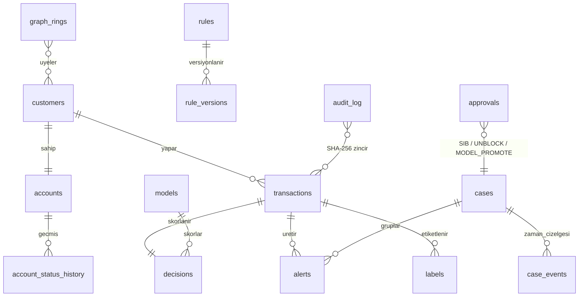

# Mimari

## Olay akışı

1. **Ingress** — `POST /api/transactions` (JWT / `X-API-Key` / HMAC imza + tek kullanımlık `X-Nonce`, rate limit) veya Redis Streams `fraud:transaction.created` (consumer group, ack, XAUTOCLAIM, deneme sayacı, **DLQ**, `transaction_id` idempotency). Pydantic `TransactionIn` sıkı doğrulama; bozuk mesaj `transaction.rejected` / DLQ.
2. **TransactionMonitor** — temel kontroller (tutar, para birimi, zaman damgası, cihaz); iyi biçimli olay `transaction.monitored`.
3. **ContextAnalyst → ScoringEngine** (senkron, LLM'siz): hesap BLOKE ise skorlamadan BLOCK; bilinmeyen müşteri HOLD; aksi halde müşteri başına kilit altında (snapshot → skor → commit) feature store (nokta-zamanlı pencereler) → harici sinyaller (burst, varlık grafı, APP/CoP, river HST, konsorsiyum) → kural DSL → LightGBM olasılığı → anomali (IForest + ECOD) → yaptırım taraması (blocking indeksi, tam + bulanık, ikincil anahtarlar: doğum yılı, uyruk) → **PolicyEngine** (stacker + sinyaller → risk → aksiyon + override'lar) → reason code'lar (TreeSHAP yalnız açıklama gerektiğinde).
4. **ActionAgent** — hesap durum makinesi (sistem yalnız yükseltir: AKTIF → INCELENIYOR → BLOKE), write-behind toplu yazıcı ile `transactions` + `decisions` (bileşenler, reason code, kural/model versiyonu, gecikme, SHAP) + **hash-zincirli audit**.
5. **Karar olayı** — `decision.made`: vaka yönetimi (alert → vaka; tipler arasında `CARD_TESTING` ayrı, eski `KART_TESTI` kayıtları okunurken eşlenir), SSE canlı akış, Redis egress (worker). BLOCK kararında karşı taraf düğümleri (alıcı hesap, cihaz) grafta `fraud` işaretlenir; müşteri düğümü yalnız analistin fraud etiketiyle.
5a. **Geri besleme** — profil öğrenmesi tek kurala bağlı: `app/features/learning.py::should_learn(decision, feedback)`. Backfill (eğitim) ve canlı sistem aynı kuralı kullanır. Step-up (OTP) sonucu `POST /api/transactions/{id}/step-up-result`, analist etiketi vaka kararıyla gelir.
6. **Async katman** — copilot zenginleştirme (APP metin sınıflandırması, AML/mule/yaptırım vakalarına otomatik ŞİB taslağı), periyodik halka tespiti; worker: DB'den halka tespiti, SLA/MASAK izleme, audit doğrulama, retrain önerisi.

## Skor katmanları

| Katman | Modül | Not |
|---|---|---|
| Feature store | `app/features/` | 48 feature, online = offline (eğitimde aynı fonksiyonlar), Redis veya bellek. `customer_lock` aynı müşterinin işlemlerini sıralar; Redis commit'i `transaction_id`'ye göre idempotent tek bir Lua betiğidir (tekrar teslimde sayaçlar iki kez artmaz) |
| Kural DSL | `app/scoring/rules.py`, `rules/core.yaml` | AST whitelist, `eval` yok; noisy-OR; action floor; DB'de versiyonlu |
| ML | `app/ml/` | Champion `fraud_gbm_v3`, challenger `fraud_gbm_v4` (gölge); parmak izinden arındırılmış sentetik üreticiyle eğitildi. LightGBM + TreeSHAP; IForest (dizi tabanlı, sklearn ile birebir); ECOD; lojistik stacker |
| Graf | `app/graph/` | pass-through, döngü, fraud yakınlığı, union-find halka, Louvain + PageRank |
| APP / CoP | `app/app_scam/` | alıcı doğrulama, sosyal mühendislik sinyalleri, dinamik uyarı |
| Online profil | `app/profile/online.py` | river Half-Space Trees, yüzdelik kalibrasyon |
| Politika | `app/scoring/policy.py` | eşikler (runtime ayarlanabilir), override'lar, tipoloji tavanı; kural HOLD/BLOCK tabanı `floor_min_risk` altında bir kademe düşer |
| Yaptırım | `app/core/sanctions.py` | blocking indeksi, bulanık eşleşme, ikincil anahtarlarla eşleşme güveni |
| Yüksek riskli ülke | `app/core/jurisdictions.py` | `data/jurisdictions/fatf_2026-06.json` (gri liste doğrulanmadı, bkz. `docs/COMPLIANCE.md`) |
| Drift | `app/pipeline.py` | PSI referansı prod dışında demo popülasyonundan kurulur (`drift_reference=auto`) |

## Veri modeli

Para `NUMERIC(18,2)` + para birimi + TRY karşılığı. Şema Alembic ile yönetilir (`0001`, `0002`); testler migration ↔ model eşitliğini doğrular.

## Güvenlik

JWT (HS256) + hiyerarşik RBAC (`analist < kidemli_analist < admin`), demo kullanıcıları yalnız `SEED_DEMO_USERS` açıkken (varsayılan prod dışı), servis anahtarı / HMAC imzası (zaman penceresi + tek kullanımlık `X-Nonce`), SSE için tek kullanımlık kısa ömürlü bilet (`POST /api/stream/ticket`; sorgu dizesinde JWT kabul edilmez), `/metrics` için `METRICS_TOKEN`, LLM'e giden veride PII maskeleme (`app/llm/redaction.py`), slowapi rate limit, CORS whitelist, katı CSP (`unsafe-inline` yok), request-id korelasyonu, sanitize edilmiş 500, maker-checker (bloke kaldırma, ŞİB, model terfisi).
