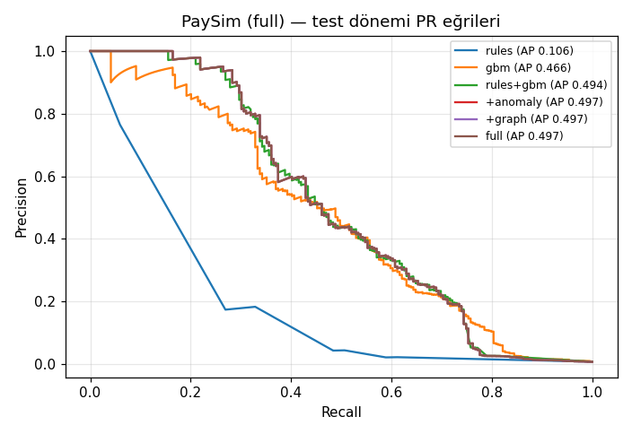
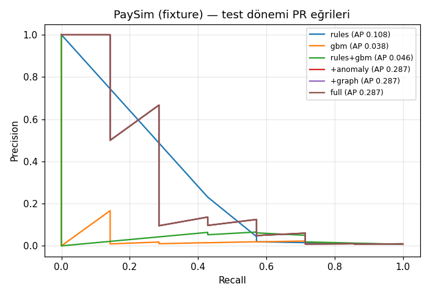
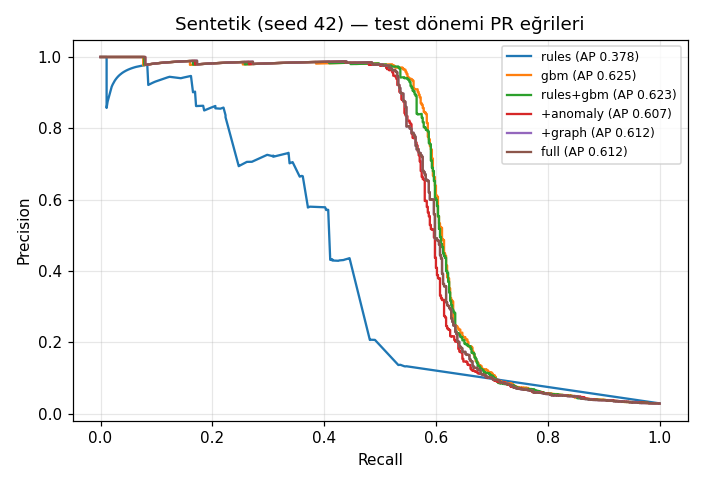

# Doğrulama raporu: halka açık veri ve sentetik veri

Bu rapordaki bütün sayılar `artifacts/validation/` altındaki JSON dosyalarından alınmıştır
(üretim zamanı 2026-09-25). Veri kaynakları, lisanslar ve sızıntı kararları için
[`docs/DATA.md`](DATA.md), yöntem için `app/validation/*.py` modül açıklamaları esas alınır.

| Kaynak dosya | İçerik |
|---|---|
| `artifacts/validation/paysim/metrics.json` | PaySim, %10 alıcı-hash örneği, 743 adımın tamamı |
| `artifacts/validation/paysim_fixture/metrics.json` | Repodaki 19.999 satırlık PaySim örneği (smoke test, indirme gerektirmez) |
| `artifacts/validation/synthetic/metrics.json` | Parmak izi temizlenmiş sentetik üretici, seed 42 |
| `artifacts/validation/elliptic/metrics.json`, `elliptic_fixture/metrics.json` | Elliptic Bitcoin grafı (graf modülü) |
| `artifacts/validation/ulb/metrics.json` | ULB kredi kartı (OpenML 1597) |
| `artifacts/validation/champion_selection.json` | Champion / challenger seçimi |

> **Önceki sürümle karşılaştırma.** Bu rapor, bağımsız ML değerlendirme denetiminden sonra yeniden
> üretildi. Değişenler: asimetrik etiket gürültüsü, kâhin (oracle) olmayan step-up sonucu,
> kalibre edilmiş negatif olmayan stacker, satır bazlı 70/15/15 zaman bölmesi, 1000 turluk
> tabakalı bootstrap, eşitliklere duyarlı alarm bütçesi, Brier/ECE ve Elliptic'te sızıntısız
> (inductive) graf özellikleri. Eski rapordaki sayılar (ör. sentetik `full` 0.6121, PaySim `full`
> 0.4968, Elliptic `all` F1 0.8149) farklı bir bölme ve farklı bir etiket modeliyle üretildiği için
> bu rapordakilerle doğrudan karşılaştırılamaz.

---

## 1. Özet

- **Sinyalin neredeyse tamamını GBM taşıyor.** PaySim'de `rules` PR-AUC 0.0462, `rules+gbm`
  0.3919. Fark +0.3457 (95 % GA [0.3045, 0.3885]). Sentetik veride fark +0.2392
  (GA [0.1854, 0.2908]).
- **Stacker, tek başına GBM'e göre veri setine bağlı.** PaySim'de `rules+gbm` − `gbm` = +0.0187
  (GA [0.0124, 0.025], katkı var). Sentetik veride −0.0044 (GA [−0.0084, −0.0006], küçük bir zarar).
- **Anomali katmanı katkı vermiyor.** Stacker ablation'ı (doğrulama bölümünün iki yarısı) anomali
  girdisini PaySim'de ve sentetik veride düşürdü; bu yüzden `+anomaly` = `rules+gbm`. ULB'de anomali
  girdisi tutuluyor ama `hybrid` − `gbm` GA [−0.0674, 0.0143], sonuç "katkı yok".
- **Graf / burst sinyallerinin (`+graph`) katkısı bulunamadı.** PaySim'de Δ = 0. Sentetik veride
  Δ = +0.0034, GA [−0.0114, 0.0188]. İki veri setinde de "katkı yok".
- **Politika katmanı (`full`) sentetik veride PR-AUC'yi düşürüyor.** Δ = −0.0118
  (GA [−0.0196, −0.0046], "zarar"). Politika sıralamayı kural taban eylemleri ve tipoloji
  tavanlarıyla değiştiriyor; bu bir sıralama metriği için zarar, bir karar kuralı olarak bilinçli.
- **Politika katmanı sentetik veride tutar ağırlıklı recall'ı yarıya indiriyor.** 1 % alarm
  bütçesinde yakalanan fraud tutarı oranı `rules+gbm` için 0.488, `full` için 0.248
  (`budget_0.01/cost`); yani politika yeniden sıralaması alarm bütçesini daha düşük tutarlı
  olaylara kaydırıyor. 2 % bütçede sıra tersine dönüyor (`full` 0.920, `rules+gbm` 0.885). PaySim'de bu etki yok
  (`full` = `rules+gbm`).
- **PaySim'de stacker sıralamanın genelinde GBM'den zayıf.** ROC-AUC 0.9125 → 0.8721, 1 % FPR'de
  recall 0.5995 → 0.5864; yalnız PR-AUC (+0.0187) iyileşiyor.
- **Elliptic'te yapısal graf özellikleri, veriyle gelen özelliklerin üstüne bir şey eklemiyor.**
  Tek başına `graph` (4 özellik) illicit F1 0.1177. `all` (165 özellik) F1 0.7984
  [0.7798, 0.817], `all+graph` 0.7891 [0.7705, 0.8065].
- **Sentetik veride eski 0.971 PR-AUC değeri bir sızıntıdan geliyordu** (§4). Bugünkü sentetik
  `gbm` PR-AUC 0.8423, `full` 0.8295. Bu değer, temizlenmiş üreticinin kolay olduğunu gösterir;
  gerçek dünya performansı iddiası değildir. PaySim'de aynı hat 0.3919 veriyor.
- **Uygulanan eylemler (PaySim `full`).** Test dönemindeki 382 fraud işleminin 280'i ALLOW aldı.
  1 % alarm bütçesinde recall 0.5471 [0.5026, 0.5975], precision 0.2186, tutar ağırlıklı recall 0.907.
- **Kalibrasyon.** Stacker çıktısı olasılık gibi davranıyor: sentetik `rules+gbm` Brier 0.006491,
  ECE 0.003784 (ham GBM: 0.008481 / 0.008341). `+graph` katmanının noisy-OR birleşimi kalibrasyonu
  bozuyor (sentetik ECE 0.080211, PaySim ECE 0.081328); bu skor olasılık olarak okunmamalı.
- **ML hattı gerçek kart verisinde çalışıyor (ULB).** GBM PR-AUC 0.7335 [0.6092, 0.8451],
  hibrit 0.7091 [0.5794, 0.841].

---

## 2. Yöntem

### 2.1 Gölge replay

`app/validation/replay.py`: Etiketli olay akışı **zaman sırasıyla**, canlı sistemin kullandığı
bileşenlerden geçer. Bu bileşenler şunlardır: bellek içi feature store, kural DSL'i, dış sinyaller
(burst, entity graph) ve politika katmanı. Replay hiçbir hesaba dokunmaz ("gölge replay"). Sıra
şöyledir:

```
feature store → rules → GBM → anomaly (IForest + ECOD) → stacker → graph/burst sinyalleri → policy
```

- Özellikler, canlı motorun kullandığı fonksiyonlarla hesaplanır (online/offline eşitliği).
  Profil öğrenme `app.features.learning.should_learn` ile yapılır.
- **Step-up sonucu bir kâhin değil.** Eskiden STEP_UP kararının sonucu doğrudan etiketten
  türetiliyordu (fraud → her zaman başarısız). Artık `app.features.learning.StepUpOutcomeModel`
  kullanılıyor: dolandırıcı OTP'yi 30 % olasılıkla geçer, meşru müşteri 5 % olasılıkla başarısız
  olur. APP dolandırıcılığında kurban ödemeyi kendisi onayladığı için geçme olasılığı 90 %;
  mule ve structuring işlemlerinde hesap sahibi işlemi kendisi yaptığı için her zaman geçer.
  Sonuç işlem kimliğiyle tohumlanır (deterministik) ve gürültülü etiketi değil gerçek tipolojiyi
  kullanır. Eğitim backfill'i (`app/ml/training.py`) ve replay aynı modeli kullanır.
- Replay sırasında analist fraud etiketleri grafa **geri beslenmez**. Beslenseydi test
  etiketleri sızardı.

### 2.2 Zaman bölmesi

- Satırlar zamana göre sıralanır ve **satır sayısına göre 70 / 15 / 15** bölünür (eğitim /
  doğrulama / test; `app.validation.evaluate.split_bounds`). Eskiden bölme zaman aralığına göre
  yapılıyordu; PaySim'de trafik zamana düzgün yayılmadığı için test kümesi yalnızca 28.124 satır
  kalıyordu.
- Bölme noktası her zaman bir zaman damgası değişimine denk getirilir: aynı damgalı satırlar
  aynı bölümde kalır.
- GBM ve anomali modelleri eğitim bölümünde, stacker doğrulama bölümünde eğitilir. Test bölümü
  hiçbir seçime girmez.
- PaySim'de eğitim `step` ≈ 323'e kadar sürer (`train_until_step`).

### 2.3 Katmanlar ve ablation

`app/validation/evaluate.py`: Her katman bir öncekine tek bir bileşen ekler.

1. `rules`: Kural DSL skoru (noisy-OR).
2. `rules+gbm`: Kural skoru ile LightGBM olasılığının stacker'ı (anomali girdisi 0).
3. `+anomaly`: Üretimdeki stacker (kural, GBM, IForest+ECOD). Stacker ablation'ı anomali
   girdisini düşürdüyse bu katman `rules+gbm` ile aynıdır.
4. `+graph`: Stacker çıktısının burst ve entity-graph sinyal skorlarıyla noisy-OR birleşimi
   (yapılandırılmış ağırlıklarla).
5. `full`: Politikanın tamamı. Kural eylem tabanları (`RULE_FLOOR`), tipoloji tavanları ve eşikler
   uygulanır, sonuçta risk skoru ve ALLOW / STEP_UP / HOLD / BLOCK kararı çıkar.

Her katmanın katkısı, önceki katmana göre PR-AUC farkıdır. Ayrıca her stack'lenmiş katman tek
başına `gbm` ile karşılaştırılır (`stacked_vs_gbm`). Farklar **eşleştirilmiş bootstrap** ile
hesaplanır. Karar kuralı:
- 95 % güven aralığı 0'ı içeriyorsa **"katkı yok"**.
- Aralık tamamen 0'ın üstündeyse **"katkı var"**.
- Aralık tamamen 0'ın altındaysa **"zarar"**.

### 2.4 Stacker

`app/ml/stacker.py`: Girdilerin logit'i üzerinde **negatif olmayan** lojistik regresyon
(Platt tipi, L2 = 0.001), doğrulama bölümünde eğitilir. Negatif olmama kısıtı, bir girdinin
yükselmesinin riski düşürmesini engeller. Eskiden katsayılara taban değer konuyordu
(`floored_legacy`); bu, çıktının kalibrasyonunu bozuyordu.

Anomali girdisi bir ablation ile seçilir: doğrulama bölümünün zamanca ilk yarısında eğitilir,
ikinci yarısında log-loss ölçülür. Anomali girdisi log-loss'u iyileştirmiyorsa düşürülür.

| Veri | floored (eski) | kısıtsız | negatif olmayan | negatif olmayan, anomalisiz | Anomali |
|---|---|---|---|---|---|
| Sentetik | 0.026013 | 0.022997 | 0.02338 | 0.02338 | düşürüldü |
| PaySim | 0.003603 | 0.003662 | 0.003662 | 0.003632 | düşürüldü |

Son katsayılar (kural, GBM, anomali): sentetik [0.087336, 1.133583, 0], kesişim 1.731249;
PaySim [0.144553, 0.963068, 0], kesişim −0.944275.

### 2.5 Metrikler

- **PR-AUC ve ROC-AUC.** 95 % güven aralığı, **tabakalı** bootstrap ile (1000 tur; fraud ve
  temiz satırlar ayrı ayrı yeniden örneklenir).
- **recall@1%FPR.** Yanlış pozitif oranı 1 % iken yakalanan fraud payı.
- **Alarm bütçesi 0.5 %, 1 % ve 2 %.** Test işlemlerinin en riskli k'sı alarm sayılır. Kesimde
  eşit skorlu satırlar kalan alarmları eşit paylaşır (`app.ml.metrics.topk_weights`). Böylece
  sonuç satır sırasına bağlı değildir ve nokta tahmini ile bootstrap aralığı aynı kuralı kullanır.
  Kural skoru gibi kaba skorlarda bu önemlidir. Her bütçe için recall (GA ile), precision ve tutar
  ağırlıklı recall (`cost_weighted_recall`) raporlanır.
- **Kalibrasyon.** Brier skoru ve 10 eşit genişlikli kutulu ECE (`calibration_test`).
- **Maliyet.** Kaçan fraud tutarına, yanlış alarm sayısı × `review_cost_try` eklenir
  (`review_cost_try` = 50.0). Karşılaştırma değeri `baseline_cost_no_system`, yani hiç sistem
  olmasaydı kaybedilecek fraud tutarının tamamı.
- **Eylem dağılımı.** `full` politikasının test dönemindeki ALLOW / STEP_UP / HOLD / BLOCK
  sayıları, bütün işlemler ve yalnız fraud işlemleri için.
- **Saat özelliği ablation'ı** (`feature_ablation.hour`): `hour`, `is_night`, `night_ratio_7d`,
  `hour_unusual` çıkarılarak GBM yeniden eğitilir.
- **Politika eşikleri:** step_up 0.35, hold 0.6, block 0.85.

---

## 3. PaySim sonuçları

### 3.1 Alt küme

| Alan | Değer |
|---|---|
| Kaynak | `PS_20174392719_1491204439457_log.csv` (tam dosya, 6.362.620 satır; bkz. DATA.md) |
| `sample_frac` | 0.1 |
| Örnekleme birimi | Alıcı (`nameDest`) bazlı hash örneklemesi. Bir alıcının bütün işlemleri ya birlikte alınır ya birlikte dışarıda kalır |
| Adımlar | 1–743 (tamamı) |
| `train_until_step` | 323.0 |
| Satır (toplam / eğitim / doğrulama / test) | 637.559 / 446.291 / 95.634 / 95.634 |
| Fraud (eğitim / doğrulama / test) | 352 / 64 / 382 (test oranı 0.00399) |
| Model | 48 özellik, 144 ağaç |
| Replay süresi | 1683.4 sn |

### 3.2 Katman sonuçları

| Katman | PR-AUC [95 % GA] | ROC-AUC [95 % GA] | recall@1%FPR | R @0.5 % | P @0.5 % | R @1 % [95 % GA] | P @1 % | R @2 % | P @2 % |
|---|---|---|---|---|---|---|---|---|---|
| `rules` | 0.0462 [0.0332, 0.0639] | 0.7412 [0.7153, 0.7693] | 0.0681 | 0.1126 | 0.09 | 0.186 [0.1568, 0.2182] | 0.0743 | 0.3357 | 0.067 |
| `gbm` | 0.3732 [0.3267, 0.4235] | 0.9125 [0.8931, 0.9291] | 0.5995 | 0.4267 | 0.341 | 0.5471 [0.5026, 0.5942] | 0.2186 | 0.6754 | 0.1349 |
| `rules+gbm` | 0.3919 [0.3464, 0.4417] | 0.8721 [0.848, 0.8965] | 0.5864 | 0.4241 | 0.3389 | 0.5471 [0.5026, 0.5975] | 0.2186 | 0.6859 | 0.137 |
| `+anomaly` | 0.3919 | 0.8721 | 0.5864 | 0.4241 | 0.3389 | 0.5471 | 0.2186 | 0.6859 | 0.137 |
| `+graph` | 0.3919 | 0.8721 | 0.5864 | 0.4241 | 0.3389 | 0.5471 | 0.2186 | 0.6859 | 0.137 |
| `full` | 0.3919 [0.3463, 0.4417] | 0.8721 [0.848, 0.8965] | 0.5864 | 0.4241 | 0.3389 | 0.5471 [0.5026, 0.5975] | 0.2186 | 0.6859 | 0.137 |

Tek başına `gbm` satırının ROC-AUC değeri (0.9125), stack'lenmiş katmanlarınkinden (0.8721)
yüksek; PR-AUC ise stack'lenmiş katmanlarda yüksek. Kural girdisi yüksek skor bölgesini
iyileştiriyor, düşük skor bölgesindeki sıralamayı bozuyor.



### 3.3 Ablation (eşleştirilmiş bootstrap)

| Karşılaştırma | ΔPR-AUC | 95 % GA | Karar |
|---|---|---|---|
| `rules+gbm` − `rules` | +0.3457 | [0.3045, 0.3885] | katkı var |
| `+anomaly` − `rules+gbm` | 0.0 | — | katkı yok (girdi düşürüldü) |
| `+graph` − `+anomaly` | 0.0 | — | katkı yok |
| `full` − `+graph` | 0.0 | — | katkı yok |
| `rules+gbm` − `gbm` | +0.0187 | [0.0124, 0.025] | katkı var |

`+graph` ve `full` katmanlarının PaySim'de sıralamaya etkisi yok: graf/burst sinyalleri ve kural
tabanları test döneminde sıralamayı değiştirmiyor.

### 3.4 Kalibrasyon (test)

| Skor | Brier | ECE (10 kutu) | Ortalama tahmin | Gözlenen oran |
|---|---|---|---|---|
| `gbm` | 0.003088 | 0.002085 | 0.002391 | 0.003994 |
| `rules+gbm` | 0.003079 | 0.002297 | — | 0.003994 |
| `+graph` | 0.009645 | 0.081328 | 0.084881 | 0.003994 |

### 3.5 Eylem dağılımı (`full`, test dönemi)

| Küme | ALLOW | STEP_UP | HOLD | BLOCK | Toplam |
|---|---|---|---|---|---|
| Tüm işlemler | 95.495 | 66 | 48 | 25 | 95.634 |
| Fraud işlemleri | 280 | 39 | 38 | 25 | 382 |

- BLOCK kararı verilen 25 işlemin 25'i fraud.
- Fraud işlemlerinin 280'i (382'nin yaklaşık 73 %'ü) ALLOW ile geçiyor. Politika eşikleri sentetik
  veriye göre ayarlandı ve PaySim'deki skor dağılımında eşiklerin üstüne az işlem çıkıyor. Aynı
  modelin 1 % alarm bütçesiyle işletilmesi 209 fraud'u (0.5471) yakalıyor; eşik kalibrasyonu
  kuruma özgü yapılmalı.

### 3.6 Maliyet (1 % alarm bütçesi, 956 alarm)

| Kalem | `full` |
|---|---|
| Yanlış alarm | 747 |
| Toplam fraud tutarı | 520,720,929.67 |
| Yakalanan fraud tutarı | 472,305,045.92 |
| Kaçan fraud tutarı | 48,415,883.75 |
| İnceleme maliyeti (747 × 50.0) | 37,350.0 |
| **Toplam maliyet** | **48,453,233.75** |
| Sistem olmadan maliyet | 520,720,929.67 |
| Tutar ağırlıklı recall | 0.907 |

Aynı bütçede `rules` katmanının toplam maliyeti 221,029,981.58 (884.96 yanlış alarm), `gbm`
katmanınınki 52,477,812.97. Tutarlar PaySim birimindedir; `paysim_try_per_unit` varsayılanı 1.0.

### 3.7 En önemli özellikler (GBM gain payı)

| Özellik | Pay |
|---|---|
| `hour` | 0.2352 |
| `amount_zscore` | 0.20644 |
| `payee_age_d` | 0.15377 |
| `amount_try` | 0.1482 |
| `is_cash_channel` | 0.11255 |
| `payee_fan_in_24h` | 0.06343 |
| `amount_log` | 0.04958 |
| `amount_ratio` | 0.01713 |
| `is_night` | 0.00682 |
| `hour_unusual` | 0.00652 |
| `first_large_transfer` | 0.00024 |
| `near_threshold` | 0.0001 |

**Saat ablation'ı.** Saat özellikleri gain'in 0.2485'ini taşıyor. Çıkarıldıklarında `gbm` PR-AUC
0.3732'den 0.3281'e [0.2823, 0.377] düşüyor; fark GA [−0.0848, −0.0056], yani anlamlı. PaySim
simülatöründe fraud adımlara neredeyse düzgün yayılırken normal trafik gün içi döngü izliyor; saat
sinyalinin bir kısmı bu simülatör özelliğinden geliyor olabilir ve gerçek bir bankaya taşınacağı
varsayılmamalı.

### 3.8 PaySim'in sınırlamaları

Ayrıntı için [DATA.md §3](DATA.md#3-paysim-eşlemesi-ve-sızıntı-kararları).

- **`nameOrig` neredeyse benzersiz.** Müşterilerin hemen hepsi tek işlem yapıyor. Müşteri bazlı
  velocity ve davranış profili özellikleri PaySim'de bilgi taşımıyor; bilgi alıcı tarafında.
- **Cihaz, IP ve oturum bilgisi yok.** Bu alanlar uydurulmadı; feature store bunları eksiklik
  göstergelerine çeviriyor. Cihaz ve oturum tabanlı ATO sinyalleri PaySim'de test edilemiyor.
- **Bazı kolonlar bilerek kullanılmadı.** Bakiye kolonları ve `isFlaggedFraud` özellik olarak
  kullanılmadı (simülatör bakiyeleri etikete bağlı güncelliyor).
- **Adım içi zaman.** PaySim'in zaman birimi saattir; adım içindeki olaylar sıralarını koruyarak
  saat içine yayılır (DATA.md).
- **Müşteri KYC bilgisi yok.** Tutar önseli, eğitim dönemindeki popülasyon medyanı
  (`amount_prior_try` = 75323.34).

### 3.9 Offline fixture (`--source fixture`, smoke test)

`tests/fixtures/paysim_sample.csv` 19.999 satırdır. Bölünme: eğitim 13.999, doğrulama 3.000,
test 3.000; fraud 12 / 0 / 14. Doğrulama bölümünde hiç fraud olmadığı için stacker sabit bir
çıktıya düşüyor (katsayılar 0, kesişim −13.8) ve stack'lenmiş katmanların PR-AUC değeri 0.0047.
`rules` 0.0546, `gbm` 0.0207 [0.0078, 0.0774]. `full` bütün işlemlere ALLOW veriyor. Fixture
yalnızca hattın uçtan uca çalıştığını kontrol eder; performans kanıtı değildir.



---

## 4. Sentetik veri

Sentetik veri: seed 42, 500 müşteri, 63.435 işlem, 926 fraud (oran 0.0146), 4 halka. Tipolojiler:
normal 62.448, mule 407, card_testing 298, ato 108, structuring 94, app 70, sanctions 10.
Satırlar 44.404 / 9.515 / 9.516; fraud 577 / 128 / 221 (test oranı 0.02322). Model 48 özellik,
97 ağaç. Replay 94.0 sn.

**Etiket gürültüsü asimetrik.** Gerçek fraud etiketlerinin 10 %'u 0'a çevrilir
(`label_noise_fn_rate` = 0.10: kaçırılmış chargeback, bildirilmemiş dolandırıcılık). Meşru
işlemlerin yalnızca 0.05 %'i fraud olarak işaretlenir (`label_noise_fp_rate` = 0.0005: friendly
fraud). Eski üretici her iki yönde 1 % çeviriyordu; bu, meşru işlemlerin çokluğu nedeniyle fraud
kümesinin yaklaşık üçte birini gürültü yapıyordu.

### 4.1 Katman sonuçları

| Katman | PR-AUC [95 % GA] | ROC-AUC | recall@1%FPR | R @0.5 % | P @0.5 % | R @1 % [95 % GA] | P @1 % | R @2 % | P @2 % | Tutar ağırlıklı recall @1 % |
|---|---|---|---|---|---|---|---|---|---|---|
| `rules` | 0.5987 [0.5315, 0.6661] | 0.879 | 0.6561 | 0.1937 | 0.8919 | 0.3721 [0.3433, 0.3982] | 0.8656 | 0.6172 | 0.7179 | 0.4799 |
| `gbm` | 0.8423 [0.7929, 0.8865] | 0.9778 | 0.8552 | 0.1991 | 0.9167 | 0.3982 [0.3756, 0.4208] | 0.9263 | 0.7919 | 0.9211 | 0.49 |
| `rules+gbm` | 0.8379 [0.787, 0.884] | 0.9756 | 0.8552 | 0.1991 | 0.9167 | 0.3982 | 0.9263 | 0.7783 | 0.9053 | 0.488 |
| `+anomaly` | 0.8379 [0.787, 0.884] | 0.9756 | 0.8552 | 0.1991 | 0.9167 | 0.3982 | 0.9263 | 0.7783 | 0.9053 | 0.488 |
| `+graph` | 0.8413 [0.791, 0.8857] | 0.9753 | 0.8778 | 0.1991 | 0.9167 | 0.3982 | 0.9263 | 0.7828 | — | 0.49 |
| `full` | 0.8295 [0.7777, 0.876] | 0.9749 | 0.8688 | 0.1991 | 0.9167 | 0.3982 [0.371, 0.4164] | 0.9263 | 0.7738 | 0.9 | 0.2482 |

Test kümesinde 221 fraud ve 95 alarmlık 1 % bütçe olduğu için recall @1 % en fazla 0.43 olabilir;
bu bütçede recall tavanı belirleyici, precision (0.9263) daha bilgilendirici.

`full` politikasının tutar ağırlıklı recall'u (0.2482) diğer katmanların yaklaşık yarısı. Alarm
sayısı ve yakalanan fraud adedi aynı; politikanın sıralaması yüksek tutarlı bazı fraud işlemlerini
bütçenin dışında bırakıyor.



### 4.2 Ablation

| Karşılaştırma | ΔPR-AUC | 95 % GA | Karar |
|---|---|---|---|
| `rules+gbm` − `rules` | +0.2392 | [0.1854, 0.2908] | katkı var |
| `+anomaly` − `rules+gbm` | 0.0 | — | katkı yok (girdi düşürüldü) |
| `+graph` − `+anomaly` | +0.0034 | [−0.0114, 0.0188] | katkı yok |
| `full` − `+graph` | −0.0118 | [−0.0196, −0.0046] | zarar |
| `rules+gbm` − `gbm` | −0.0044 | [−0.0084, −0.0006] | zarar |
| `+graph` − `gbm` | −0.001 | [−0.0159, 0.0144] | katkı yok |
| `full` − `gbm` | −0.0128 | [−0.0294, 0.0046] | katkı yok |

### 4.3 Kalibrasyon, eylemler ve maliyet

| Skor | Brier | ECE (10 kutu) |
|---|---|---|
| `gbm` | 0.008481 | 0.008341 (ortalama tahmin 0.015126, gözlenen 0.023224) |
| `rules+gbm` | 0.006491 | 0.003784 |
| `+graph` | 0.012772 | 0.080211 |

Ham GBM olasılığı eğitim dönemindeki fraud oranını öğrendiği için test döneminde düşük kalıyor;
doğrulama bölümünde eğitilen stacker bunu düzeltiyor.

| Küme | ALLOW | STEP_UP | HOLD | BLOCK |
|---|---|---|---|---|
| Tüm işlemler | 9.275 | 57 | 66 | 118 |
| Fraud işlemleri | 37 | 17 | 58 | 109 |

1 % bütçede (`full`, 95 alarm): 7 yanlış alarm, kaçan fraud tutarı 1,877,119.42 (toplam
2,496,955.61). Aynı bütçede `rules` 12.77 yanlış alarm veriyor.

**Özellikler.** En önemli özellikler: `amount_ratio` 0.13964, `login_to_transfer_s` 0.10016,
`time_since_last_s` 0.09972, `amount_zscore` 0.09429, `payee_relation_age_d` 0.08619,
`amount_try` 0.06188, `hour` 0.05125, `payee_age_d` 0.05058, `paste_used` 0.04687,
`device_customers_7d` 0.03623. Saat özellikleri gain'in 0.0916'sını taşıyor; çıkarıldıklarında
`gbm` PR-AUC 0.8333 [0.7819, 0.8824], fark GA [−0.0301, 0.013] (anlamlı değil).

### 4.4 Eski 0.971 neden artık yok

1. **Parmak izi kaldırıldı.** Eski üretici ATO işlemlerinde `DEV-ATO-*` biçiminde cihaz
   kimlikleri üretiyordu; etiket cihaz alanına yazılmış oluyordu. `fraud_gbm_v1` modelinde
   `is_new_device` ve `device_age_d` gain'in 54 %'ünü taşıyordu. v1/v2'nin 0.971 / 0.967 değerleri
   bu sızıntıdan geliyordu (registry: `archived`).
2. **Etiket modeli değişti.** v3/v4 simetrik 1 % gürültü ve kâhin step-up ile eğitildi; v5/v6
   asimetrik gürültü ve kâhin olmayan step-up ile. Bu nedenle v1–v4 sayıları v5/v6 ile
   karşılaştırılamaz.
3. **Sentetik ile PaySim farklı şeyler ölçüyor.** Sentetik veride cihaz, oturum, müşteri geçmişi
   ve alıcı ilişkisi var ve kural kataloğu ile üretici aynı tipolojileri modelliyor (`rules`
   PR-AUC 0.5987, PaySim'de 0.0462). Temel oranlar da farklı (0.02322 / 0.00399). Sentetik
   PR-AUC'nin yüksekliği üreticinin öğrenilebilirliğini gösterir, sistemin gerçek performansını değil.

---

## 5. Elliptic (graf modülü)

`app/validation/elliptic.py`: Düğüm sınıflandırması (illicit / licit). "Unknown" düğümler grafta
kalır ama skorlanmaz.

- **Veri:** 203.769 düğüm, 234.355 kenar.
- **Bölme:** Weber et al. (2019) standart zaman bölmesi: zaman adımı **1–34 eğitim, 35–49 test**.
  Eğitimde 29.894 düğüm (3.462 illicit), testte 16.670 düğüm (1.083 illicit).
- **Graf özellikleri (4):** `pagerank`, `in_degree`, `out_degree`, `component_size`. Özellikler
  **inductive** hesaplanır: her düğüm yalnızca kendi zaman adımının alt grafında görülür.
  Adımlar arası kenar sayısı 0 olduğu için bu, test grafının eğitim sırasında görülmemesini sağlar.
- **Erken durdurma:** Adım 1–29 ile eğitilir, 30–34 ile doğrulanır (sabır 50 tur); bulunan tur
  sayısıyla 1–34 üzerinde yeniden eğitilir.
- **Eşik:** Yalnızca eğitim döneminde, genişleyen pencereli zamansal katlarla (doğrulama
  adımları 20–24, 25–29, 30–34) out-of-fold tahminlerde F1'i en yüksek yapan eşik. Test verisi eşik
  seçimine girmez. Karşılaştırma için 0.5 eşiğindeki F1 de verilir.
- **Güven aralıkları:** Test düğümleri üzerinde 1000 turluk tabakalı bootstrap.

| Özellik kümesi | Özellik | Illicit F1 [95 % GA] | Precision | Recall | PR-AUC [95 % GA] | Eşik | F1 @0.5 | Tur |
|---|---|---|---|---|---|---|---|---|
| `graph` | 4 | 0.1177 [0.1093, 0.1257] | 0.0693 | 0.3887 | 0.0754 [0.0712, 0.0809] | 0.1144 | 0.0 | 22 |
| `local` | 93 | 0.7447 [0.723, 0.7639] | 0.7586 | 0.7313 | 0.7867 [0.7645, 0.8075] | 0.2831 | 0.773 | 229 |
| `local+graph` | 97 | 0.7313 [0.7099, 0.7505] | 0.7313 | 0.7313 | 0.7846 [0.7627, 0.8057] | 0.265 | 0.7664 | 182 |
| `all` | 165 | 0.7984 [0.7798, 0.817] | 0.8764 | 0.7331 | 0.805 [0.785, 0.8249] | 0.2633 | 0.8192 | 351 |
| `all+graph` | 169 | 0.7891 [0.7705, 0.8065] | 0.8482 | 0.7378 | 0.8031 [0.7829, 0.8233] | 0.2073 | 0.8201 | 311 |

**Yorum.** Yapısal graf özellikleri tek başına zayıf (F1 0.1177, PR-AUC 0.0754). Veriyle gelen
özelliklere eklendiklerinde F1 düşüyor (`local` → `local+graph` −0.0134, `all` → `all+graph`
−0.0093), PR-AUC neredeyse değişmiyor. Eşleştirilmiş fark aralıkları hesaplanmadı; tek tek
aralıklar büyük ölçüde örtüşüyor. Sonuç: graf özellikleri veriyle gelen özelliklerin üstüne
bilgi eklemiyor.

Eski rapordaki `all` F1 0.8149 değeri erken durdurma ve zamansal eşik katları olmadan
üretilmişti. Bugünkü 0.7984, eşiği ve tur sayısını yalnızca geçmiş adımlarla seçtiği için daha
temkinli bir tahmindir.

**Neden fraud-proximity özelliği kullanılmadı.** Platformda bilinen illicit bir düğüme olan hop
mesafesini ölçen bir özellik var. Elliptic'te kenarlar zaman adımları arasında hiç geçmediği için
test düğümleri hiçbir eğitim etiketine ulaşamıyor; eğitimdeki her illicit düğüm ise kendi tohumu
oluyor (mesafe 0). Sonuçta özellik yalnızca eğitim etiketini kodluyor. Bu özellikle yapılan ilk
çalıştırmada illicit F1 0.13–0.23'e düştü ve sızıntı bu şekilde fark edildi.

### Literatür karşılaştırması

Kaynak: Weber et al. (2019), *Anti-Money Laundering in Bitcoin: Experimenting with Graph
Convolutional Networks for Financial Forensics*,
[arXiv:1908.02591](https://arxiv.org/abs/1908.02591). Değerler Table 1 ve Table 2'den alındı.
Hepsi illicit sınıfa ait ve aynı zaman bölmesiyle hesaplanmış. AF: tüm özellikler, NE: node embedding.

| Yöntem | Illicit F1 | Kaynak |
|---|---|---|
| Logistic Regression (AF) | 0.481 | Table 1 |
| Random Forest (AF), P 0.956 / R 0.670 | 0.788 | Table 1 |
| Random Forest (AF + NE) | 0.796 | Table 1 |
| MLP (AF) | 0.653 | Table 1 |
| GCN | 0.628 | Table 1 |
| Skip-GCN | 0.705 | Table 1 |
| EvolveGCN | 0.720 | Table 2 |
| **Bu çalışma: LightGBM `all`** | **0.7984** [0.7798, 0.817] (P 0.8764 / R 0.7331) | `elliptic/metrics.json` |

- Bu çalışmadaki LightGBM `all` sonucu, makaledeki Random Forest (AF) sonucuyla aynı büyüklükte;
  makale değeri güven aralığımızın içinde. İkisi de veriyle gelen 165 özelliği kullanan ağaç
  tabanlı modeller.
- Aynı veri ve aynı bölme kullanıldı, ancak kod ve eşik seçim yöntemi farklı; küçük farklar
  anlamlı kabul edilmemeli.
- **GraphSAGE / GNN çalıştırılmadı.** `torch_geometric` kurulu değil.

**Fixture (smoke test).** `tests/fixtures/elliptic_sample`: eğitimde 131 düğüm (21 illicit),
testte 71 düğüm (10 illicit). F1: `graph` 0.2469, diğer kümeler 0.3333 (`local` GA [0, 0.6667]);
PR-AUC 0.1573 / 0.5248 / 0.5253 / 0.5019 / 0.5524. Yalnızca hattın çalıştığını kontrol eder.

---

## 6. ULB kredi kartı (ML hattı sağlamlık kontrolü)

`app/validation/ulb.py`, OpenML 1597.

- **Bölme:** Satır sırasına göre 70 / 15 / 15: eğitim 199.364, doğrulama 42.721, test 42.722 satır.
- **Test fraud:** 52 (oran 0.00122).

| Skor | PR-AUC [95 % GA] | ROC-AUC | recall@1%FPR | Recall @1 % bütçe [95 % GA] | Precision @1 % | Tutar ağırlıklı recall @1 % | Brier | ECE |
|---|---|---|---|---|---|---|---|---|
| `gbm` | 0.7335 [0.6092, 0.8451] | 0.9795 | 0.8462 | 0.8462 [0.7495, 0.9423] | 0.103 | 0.7799 | 0.000441 | 0.000322 |
| `anomaly` | 0.0419 [0.0312, 0.0581] | 0.933 | 0.5769 | 0.5577 | 0.0679 | — | — | — |
| `hybrid` | 0.7091 [0.5794, 0.841] | 0.9484 | 0.7885 | 0.7885 [0.6731, 0.8846] | 0.096 | 0.6186 | 0.000438 | 0.000074 |

**Sonuç.** Stacker ablation'ı ULB'de anomali girdisini tuttu (katsayılar kural 0.003736, GBM
0.881574, anomali 0.409023). Buna rağmen `hybrid` − `gbm` PR-AUC farkının GA'sı
[−0.0674, 0.0143], "katkı yok". Hibrit skor kalibrasyonu (ECE) iyileştiriyor, sıralamayı
iyileştirmiyor. Test kümesinde 52 fraud olduğu için aralıklar geniş.

**Sınırlamalar:**
- Özellikler anonimleştirilmiş PCA bileşenleri (artı `Amount`). Kural motoru, feature store ve
  graf katmanı bu veriye uygulanamıyor. Yalnızca ML hattı test ediliyor (`rule` girdisi 0).
- OpenML kopyasında `Time` kolonu yok; kaynağın kronolojik satır sırası zaman yerine kullanıldı.

---

## 7. Champion / challenger

`scripts/champion_selection.py`: Parmak izi temizlenmiş sentetik veri (seed 42) yeniden üretilir
ve üretim eğitim koduyla iki aday eğitilir. **Seçim yalnızca doğrulama bölümünde yapılır**; test
bölümü ve PaySim transfer sonuçları yalnızca raporlanır, seçime girmez.

| Aday | Parametreler | Doğrulama PR-AUC | Doğrulama kaçan tutar payı @1 % | Test PR-AUC | Test ROC-AUC | Test recall@1%FPR | Test tutar ağırlıklı recall @1 % | PaySim PR-AUC | PaySim ROC-AUC | PaySim toplam maliyet @1 % |
|---|---|---|---|---|---|---|---|---|---|---|
| `fraud_gbm_v5` | seed 42, 300 tur, 100 IForest ağacı | 0.7852 | **0.1449** | 0.8355 | 0.973 | 0.8507 | 0.5075 | 0.0119 | 0.6891 | 422,188,623.48 |
| `fraud_gbm_v6` | seed 7, 500 tur, 200 IForest ağacı | 0.7899 | 0.1982 | 0.8401 | 0.978 | 0.8552 | 0.5353 | 0.0122 | 0.7042 | 420,953,275.86 |

- **Seçim kuralı:** 1 % alarm bütçesinde doğrulama bölümünde kaçan fraud tutarı payı en düşük
  aday. **Kazanan:** `fraud_gbm_v5` (0.1449, v6 için 0.1982). `fraud_gbm_v6` challenger olarak
  gölge skorlamada kalır.
- Test bölümünde v6 biraz daha iyi görünüyor (PR-AUC 0.8401 / 0.8355). Bu, test sonucuna bakarak
  seçim yapılmamasının bedeli. İki aday arasındaki fark küçük; eşleştirilmiş güven aralığı
hesaplanmadı.
- **Kalibrasyon (test, hibrit):** v5 Brier 0.00662, ECE 0.00378; v6 0.00626 / 0.00375.
- **Transfer sonucu:** Sentetik veride eğitilen adaylar PaySim'e taşınmıyor (PR-AUC 0.0119 /
  0.0122; PaySim'de eğitilen GBM 0.3732). Sentetik veride eğitilmiş bir model gerçek bir banka
  akışına yeniden eğitilmeden konmamalı.
- **Arşiv:** v1/v2 (sızıntılı üretici) ve v3/v4 (simetrik gürültü, kâhin step-up) `archived`.
- **Dört göz kaydı** (maker-checker, gerçek API üzerinden):

| Alan | Değer |
|---|---|
| `approval_id` | 1 |
| `requested_by` | `admin` |
| `approved_by` | `kidemli_analist` |
| Talep edenin kendi onayı | HTTP 403 (reddedildi) |
| Sonuç | ONAYLANDI |

---

## 8. Sınırlamalar ve yeniden üretim

### Komutlar

```bash
python scripts/fetch_public_fraud_data.py                                # PaySim + Elliptic + ULB → data/external/
python scripts/validate_public_data.py --dataset paysim --sample-frac 0.1
python scripts/validate_public_data.py --dataset paysim --source fixture # indirmesiz, tests/fixtures/
python scripts/validate_public_data.py --dataset elliptic
python scripts/validate_public_data.py --dataset ulb
python scripts/validate_public_data.py --dataset synthetic
python scripts/champion_selection.py                                     # --no-promote: terfi etmeden karşılaştır
```

Çıktılar `artifacts/validation/<set>/metrics.json` ve `docs/img/validation/` altındaki PR
eğrileridir. `--reuse-replay` bayrağı replay'i `data/external/cache/` altına kaydeder; kod
değiştiğinde bu önbellek silinmelidir.

### Sınırlamalar ve olumsuz sonuçlar

- **Kaggle setleri çalıştırılmadı.** IEEE-CIS, BAF (NeurIPS 2022) ve IBM AML atlandı, çünkü
  Kaggle kimlik bilgileri ortamda tanımlı değil (DATA.md §1).
- **PaySim'in %10'u kullanıldı.** Tam 6,36 milyon satırlık replay yapılmadı.
- **Replay hızı.** Replay tek süreçte çalışır. PaySim: 637.559 olay 1683.4 sn (yaklaşık 379
  olay/sn). Sentetik: 63.435 olay 94.0 sn (yaklaşık 675 olay/sn).
- **Eşikler PaySim'e göre ayarlanmadı.** PaySim'de fraud işlemlerinin 73 %'ünün ALLOW alması
  (§3.5) büyük ölçüde bundan kaynaklanıyor.
- **Katkı iddiası yapılmıyor.** Anomali katmanı hiçbir veri setinde, graf katmanı PaySim, sentetik
  ve Elliptic'te katkı göstermedi. Politika katmanı sentetik veride PR-AUC'yi düşürüyor. Bu
  katmanlar hatta duruyor (açıklanabilirlik, kural tabanları, operasyonel sinyaller), ancak bu
  sonuçlarla bir performans katkısı iddia edilmemeli.
- **`+graph` skoru olasılık değil.** Noisy-OR birleşimi kalibrasyonu bozuyor (ECE ≈ 0.08).
  Politika eşikleri bu skora uygulanıyor; eşikler bir olasılık olarak yorumlanmamalı.
- **Elliptic'te eşleştirilmiş fark aralıkları yok.** Her özellik kümesi için bootstrap güven
  aralığı var, ancak kümeler arası farklar için eşleştirilmiş aralık hesaplanmadı.
- **Sentetik sonuçlar üst sınır.** Üretici ile kural kataloğu aynı tipolojileri modelliyor;
  sentetik PR-AUC gerçek dünya performansı yerine geçmez.
